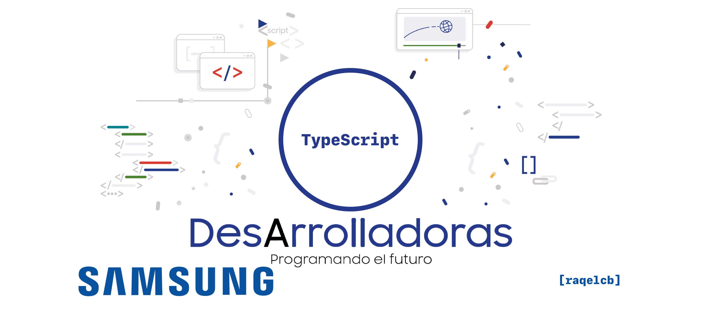

<!-- PROJECT LOGO -->
<br />
<p align="center">
  <a href="https://www.europe-samsung.com/smsdev/Noticias/Detalle/adentrate_en_el_mundo_de_la_programacion_con_la_nueva_edicion_del_programa_formativo_samsung_desarrolladoras/174b17f7-e14e-447f-9524-7f55f414a0f5">
    
  </a>

  <p align="center">
    The purpose of this project is to create classes to store the logic of an address book with the personal data of individuals: addresses, phone numbers, e-mails... Each class must be created in a different TypeScript file.
    <br />
    <a style="color:#874EA0" href="https://github.com/raqelcb/SamsungDesArrolladoras-TypeScript/blob/main/EnunciadoTypeScript.pdf"><strong>Explore the subject »</strong></a>
    <br />
    <br />
    <a style="color:#874EA0" href="https://github.com/raqelcb/SamsungDesArrolladoras-Lab_form">Laboratorio Formulario</a>
    ·
    <a style="color:#874EA0" href="https://github.com/raqelcb/SamsungDesArrolladoras-TypeScript">TypeScript</a>
    ·
    <a style="color:#874EA0" href="https://github.com/raqelcb/SamsungDesArrolladoras-JSON">JSON</a>
    ·
    <a style="color:#874EA0" href="https://github.com/raqelcb/SamsungDesArrolladoras-API_HTML">API’s de HTML5</a>
     ·
    <a style="color:#874EA0" href="https://github.com/raqelcb/SamsungDesArrolladoras-AngularL">Angular</a>
     ·
    <a style="color:#874EA0" href="https://github.com/raqelcb/SamsungDesArrolladoras-Node.js">Node.js</a>
     ·
    <a style="color:#874EA0" href="https://github.com/raqelcb/SamsungDesArrolladoras-API-REST_Express">API REST con Express</a>
         ·
    <a style="color:#874EA0" href="https://github.com/raqelcb/SamsungDesArrolladoras-Lab_FullStack">Laboratorio FullStack</a>
  </p>
</p>
<br>
<!-- TABLE OF CONTENTS -->
<!-- <details open="open"> -->
  <summary><h2 style="display: inline-block">Table of Contents</h2></summary>
  <ul>
    <li>
      <a style="color:#874EA0" href="#about-the-project">About The Project</a>
      <ul>
        <!-- <li><a style="color:#874EA0" href="#parts-of-the-project">Parts of the project</a></li> -->
        <li><a style="color:#874EA0" href="#list-of-rules">List of rules</a></li>
      </ul>
    </li>
    <li>
      <a style="color:#874EA0" href="#usage">Usage</a>
    </li>
    <li><a style="color:#874EA0" href="#license">License</a></li>
  </ul>
</details>

<br>

<!-- ABOUT THE PROJECT -->
## About The Project

Se propone realizar unas clases para almacenar la lógica de una agenda con los datos personales de los individuos: direcciones, teléfonos, mails… Cada clase ha de crearse en un archivo TypeScript diferente.
`SamsungDesarrolladoras`, `TypeScript`
<!-- <br>

### Parts of the project

* [X] **Rules:** xxxx
* [X] **Checker:** xxxx -->

<br>

### List of rules
Se valorará la correcta selección de tipos y la definición de funciones necesarias para acceso a los atributos.

Una vez realizadas las clases:

- Se creará un módulo principal (main) en el que se utilicen las clases definidas para crear 3 registros de persona y mostrarlos en el terminal mediante console.log., utilizando las funciones necesarias definidas en las clases para obtener los datos.

- Se modificará uno de los registros de persona añadidos, realizando la búsqueda por DNI y añadiendo una nueva dirección, un nuevo mail y un nuevo teléfono. Estos cambios se deben realizar mediante el uso de métodos definidos previamente en las clases.

- Se mostrarán desde el módulo principal los 3 registros con los cambios realizados anteriormente en la consola.

<!-- INSTALLATION -->
## Usage

To get a local copy up and running follow these simple steps.


1. Clone the repo
   ```sh
   git clone https://github.com/raqelcb/SamsungDesarrolladoras-TypeScript.git
   ```
2. Compile without the flags to create the `built` folder
    ```sh
    tsc
    ````
3. Execute
    ```sh
    node built/main.js
    ```

<br>

<!-- LICENSE -->
## License

Distributed under the
[MIT](https://choosealicense.com/licenses/mit/) License. See `LICENSE` for more information.

<br>
